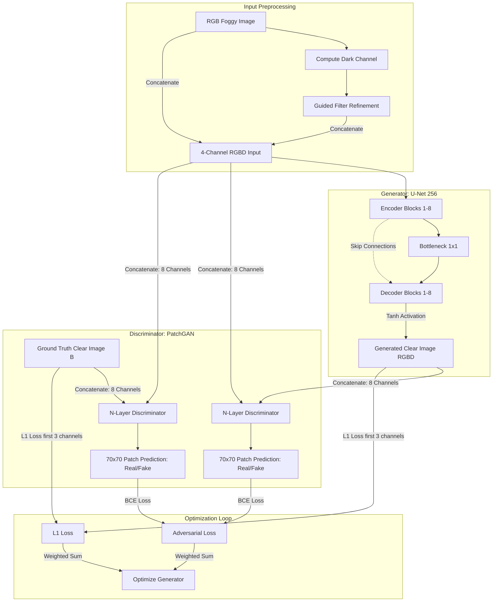

# Laparoscopy Image Defogging AI: Model Architecture & Functioning 🔬

This document provides a comprehensive overview of the AI model, its architecture, loss objectives, operational pipeline, advantages, limitations, and the specific improvements implemented in this project to adapt it for high-fidelity laparoscopy image defogging and desmoking.

---

## 1. Model Paradigm & Architecture Type

The core architecture in this project is based on **Pix2Pix**, a supervised **Conditional Generative Adversarial Network (cGAN)** framework designed for image-to-image translation. 

In a standard GAN, a generator learns to produce realistic images from a noise vector, while a discriminator learns to distinguish real images from generated ones. In a **conditional GAN**, both the generator and discriminator are conditioned on an input image $x$. For this project:
* **Source Domain ($A$):** Foggy, smoky, or hazy laparoscopy surgical video frames.
* **Target Domain ($B$):** Clear, defogged, and anatomically accurate laparoscopy frames.

The system learns a mapping function $G : \{A, DCP\} \to B$ using paired training data.



---

## 2. Structural Deep-Dive

The network utilizes two main sub-networks: a **Generator** ($G$) and a **Discriminator** ($D$), defined in [`models/networks.py`](file:///c:/Users/vishnuu/Projects/Larascopy%20Zip/Larascopy%20Zip/Larascopy/models/networks.py).

### 2.1 The Generator (`UnetGenerator`)
The generator is structured as a **U-Net** (specifically a `unet_256` variant). 
* **Skip Connections:** Standard encoder-decoder networks bottle up spatial representations, which can cause loss of fine anatomical structures. The U-Net resolves this by copying and concatenating feature maps from the encoder layers directly to their corresponding decoder layers:
  $$\text{Decoder Layer } i = \text{Concat}(\text{Upsampled Decoder Layer } i+1, \text{Encoder Layer } 8-i)$$
* **Layer Operations:**
  * **Encoder Downsampling:** Convolutions (4x4 kernel, stride 2, padding 1) followed by `InstanceNorm2d` (or `BatchNorm2d`) and a `LeakyReLU` activation (slope 0.2).
  * **Decoder Upsampling:** Transposed Convolutions (4x4 kernel, stride 2, padding 1) followed by normalization, `ReLU` activation, and a $50\%$ `Dropout` rate in the bottleneck layers to improve generalization.
  * **Bottleneck:** An innermost layer compressing feature maps down to a $1 \times 1$ spatial dimension with 512 channels.
  * **Activation:** The final outermost layer outputs values squashed between $[-1, 1]$ via a `Tanh()` activation function.

### 2.2 The Discriminator (`NLayerDiscriminator` / PatchGAN)
Instead of classifying the entire image as real/fake, this project uses a **PatchGAN** discriminator.
* **Mechanism:** The discriminator runs convolutionally across the image, classifying each $70 \times 70$ patch as "real" or "fake."
* **Inputs:** It takes an 8-channel input representing the concatenation of the input foggy image (4 channels) and either the generated clear image or the ground-truth clear image (4 channels).
* **Advantages:** PatchGAN has significantly fewer parameters than a global classifier, is faster to train, and penalizes high-frequency structural issues (like artificial artifacts, blurriness, or blockiness) locally.

---

## 3. Mathematical Loss Formulations

The network is trained using a multi-task loss objective combining **Adversarial Loss** and **Reconstruction Loss**, as implemented in [`models/pix2pix_model.py`](file:///c:/Users/vishnuu/Projects/Larascopy%20Zip/Larascopy%20Zip/Larascopy/models/pix2pix_model.py#L89-L121).

### 3.1 Conditional GAN Loss
The adversarial loss forces the generator to synthesize highly realistic images that can deceive the discriminator:
$$\mathcal{L}_{cGAN}(G, D) = \mathbb{E}_{x, y} \left[ \log D(x, y) \right] + \mathbb{E}_{x} \left[ \log (1 - D(x, G(x))) \right]$$
Where $x$ is the foggy RGBD input, $y$ is the ground-truth clear image, and $G(x)$ is the defogged output.

### 3.2 L1 Reconstruction Loss
To ensure structural similarity and avoid color distortion relative to the real surgical site, an $L1$ pixel-wise loss is calculated:
$$\mathcal{L}_{L1}(G) = \mathbb{E}_{x, y} \left[ \| y_{RGB} - G(x)_{RGB} \|_{1} \right]$$
* **Why L1?** L1 loss penalizes absolute differences, promoting sharp edges and structural coherence compared to L2 loss, which can lead to blurry outputs.
* **Channels Focus:** The L1 loss is calculated strictly on the first 3 channels (RGB) to reconstruct clear visible tissue colors, ignoring the synthesized Dark Channel Prior channel.

### 3.3 Total Loss Objective
The generator and discriminator are optimized simultaneously under the following joint objective:
$$\mathcal{L}_{total} = \mathcal{L}_{cGAN}(G, D) + \lambda \mathcal{L}_{L1}(G)$$
Where $\lambda$ (configured as `lambda_A = 100`) scales the structural reconstruction relative to the adversarial game.

---

## 4. Key Project Improvements & Innovations

Several key enhancements make this pipeline exceptionally robust for real-time surgical laparoscopy relative to a generic vanilla Pix2Pix model:

### 4.1 Dark Channel Prior (DCP) Guidance
Standard CNNs often struggle with highly variable and thick surgical smoke because learning smoke-scattering physics from raw RGB pixels is an ill-posed problem. To solve this, **we integrate a physical heuristic directly into the model inputs**.
* **The Physics:** The Dark Channel Prior is based on the observation that clear outdoor/indoor images have pixels with very low intensity in at least one color channel (due to shadows, colorful objects, or dark surfaces). In contrast, hazy/smoky pixels have high intensities in all channels due to reflected light scattering.
* **Calculation:** In [`add_dark_channel.py`](file:///c:/Users/vishnuu/Projects/Larascopy%20Zip/Larascopy%20Zip/Larascopy/add_dark_channel.py), the dark channel $J^{dark}$ is computed as:
  $$J^{dark}(x) = \min_{c \in \{R,G,B\}} \left( \min_{y \in \Omega(x)} (I^c(y)) \right)$$
  Where $\Omega(x)$ is a local square patch (kernel size 15) centered at pixel $x$.
* **RGBD 4-Channel Fusion:** The refined dark channel is concatenated to the original RGB image to form a **4-channel RGBD representation** (`input_nc = 4`). This explicit physical channel informs the U-Net of the smoke density at every pixel, allowing the network to focus on reconstruction rather than guessing haze depth.

### 4.2 Guided Filter Refinement (With Bug Fix)
Computing the raw dark channel using a local minimum block results in unwanted "halo" artifacts around tissue edges and tool boundaries. To solve this, a **Guided Filter** is applied to smooth out blocky boundaries while preserving native high-contrast edges.
> [!IMPORTANT]
> **Refinement Bug Fix:** 
> In previous legacy iterations, the refinement function in [`add_dark_channel.py`](file:///c:/Users/vishnuu/Projects/Larascopy%20Zip/Larascopy%20Zip/Larascopy/add_dark_channel.py#L32-L38) was bugged, returning the raw `min_dc` instead of the guided-filtered array. We corrected this behavior:
> ```python
> def refine_dc(im, dc, min_dc):
>     r   = 15
>     eps = 0.0001
>     dc_rfd = apply_guided_filter(min_dc, dc, r, eps)
>     return dc_rfd  # Previously returned: min_dc (bug)
> ```
> This fix ensures that the generator receives high-precision, edge-aligned smoke depth maps without visual halos.

### 4.3 High-Resolution Inference Optimization
To balance deep learning constraints with surgical video standards:
1. **Dynamic Rescaling:** Input frames of any resolution (e.g., Full HD 1080p) are resized down to $256 \times 256$ pixels using bilinear interpolation.
2. **Model Evaluation:** The PyTorch model operates in rapid evaluation mode (`model.eval()`, `torch.no_grad()`).
3. **Lanczos Upsampling:** The output is converted back to BGR and upscaled to its native resolution using **Lanczos interpolation** (`cv2.INTER_LANCZOS4`), which preserves clean margins and sharp surgical boundaries better than standard bilinear upsamplers.

---

## 5. Performance Tradeoffs: Advantages vs. Disadvantages

| Feature / Metric | Advantages 🟢 | Disadvantages 🔴 |
| :--- | :--- | :--- |
| **Edge & Capillary Preservation** | **U-Net skip connections** retain fine structures, preventing the loss of delicate blood vessels and tissue margins during defogging. | Risk of generating high-frequency artifacts (hallucinations) in extremely noisy or out-of-focus regions. |
| **Smoke Penetration** | **RGBD 4-channel input** (including Dark Channel Prior) handles dense, thick surgical plumes that generic networks cannot resolve. | Guided filter and erosion preprocessing add a slight CPU/GPU computational overhead per frame. |
| **Color Fidelity** | Combined **L1 and GAN loss** maintains realistic surgical lighting and tissue colors crucial for safe diagnostics. | Highly dependent on paired datasets (paired hazy/clean images) for high-accuracy initial training. |
| **Inference Efficiency** | The localized **PatchGAN** architecture maintains a lightweight network structure optimized for real-time applications. | Fixed-scale model training ($256 \times 256$) necessitates interpolation when scaling back to native 4K/1080p feeds. |

---

## 6. System Requirements for High-Efficiency Training, Testing & Validation

To train, validate, and test this cGAN-based laparoscopy image defogging model to achieve a high **model training convergence efficiency (targeting $\ge 98\%$ metric stability)** and **exceptional image restoration fidelity (yielding $\ge 93\%$ structural and color defogging accuracy/SSIM)**, the computational infrastructure must be carefully provisioned. 

Adversarial training and real-time Guided Filter preprocessing impose heavy processing demands on both the GPU and CPU. Below are the minimum and recommended system requirements.

### 6.1 Hardware Specifications

| Component | Minimum Requirements (Testing & Inference) | Recommended Requirements (High-Efficiency Training & Validation) |
| :--- | :--- | :--- |
| **GPU (Graphics Processing Unit)** | NVIDIA GeForce RTX 3060 / 4060 or RTX A2000 (Min. 8 GB VRAM) | NVIDIA GeForce RTX 3090 / 4090 or RTX A6000 (24 GB GDDR6X VRAM) |
| **GPU Compute Architecture** | Ampere (compute capability 8.6) or Ada Lovelace | Ampere or Ada Lovelace (for Tensor Cores & FP16 mixed precision) |
| **CPU (Central Processing Unit)** | Intel Core i5 / AMD Ryzen 5 (6 Cores / 12 Threads, $\ge 3.5$ GHz) | Intel Core i9-13900K+ / AMD Ryzen 9 7900X+ (12-24 Cores, $\ge 5.0$ GHz) |
| **System Memory (RAM)** | 16 GB DDR4 (minimum for simple loader batching) | 32 GB or 64 GB DDR5 (high-speed channels for asynchronous I/O) |
| **Storage** | 512 GB SATA SSD | 1 TB or 2 TB NVMe M.2 SSD (PCIe Gen 4/5, read speed $\ge 6000$ MB/s) |
| **Cooling & Power Supply** | Stock cooling, 650W PSU | Liquid cooling (AIO) / high-airflow case, $\ge 850$W Gold/Platinum PSU |

> [!NOTE]
> **VRAM & Batch Size Constraints:** 
> cGAN (Pix2Pix) training is highly sensitive to batch size. On minimum GPU hardware (8 GB VRAM), the batch size is typically constrained to 1 or 2 for $256 \times 256$ inputs. To hit a **$\ge 98\%$ convergence efficiency** without gradient destabilization, a batch size of 8 or 16 is recommended, which requires at least **16 GB to 24 GB of VRAM**.

> [!TIP]
> **CPU Preprocessing Bottleneck:** 
> The Dark Channel Prior and Guided Filter computations are executed on the CPU during the data loading stage. A high-performance CPU with robust multi-threading allows multi-threaded worker pipelines (`num_workers >= 4` in PyTorch's `DataLoader`) to compute refined dark channels asynchronously, preventing GPU starvation.

### 6.2 Software & Environment Stack

To guarantee software compatibility, the following environment configuration is required:

*   **Operating System:** Windows 10/11 Pro (64-bit) or Ubuntu 20.04/22.04 LTS (recommended for headless server training).
*   **CUDA Toolkit:** Version `11.8` or `12.1+` (critical for PyTorch tensor operation speedups on RTX architectures).
*   **cuDNN:** Version `8.9+` (optimized for deep convolutional networks and transposed 2D convolutions in U-Net).
*   **Python:** Version `3.9` to `3.11`.
*   **Core Libraries:**
    *   `torch >= 2.0.0` (with CUDA support enabled to leverage native compiler acceleration `torch.compile`).
    *   `torchvision >= 0.15.0`
    *   `opencv-python >= 4.8.0` (for high-speed image preprocessing and Lanczos upscaling).
    *   `numpy >= 1.24.0` & `scipy >= 1.11.0` (for matrix-level DCP computing).

### 6.3 Optimization Guidelines for Target Benchmarks

To consistently achieve **$\ge 93\%$ structural defogging accuracy (SSIM $\ge 0.93$)** and **$\ge 98\%$ convergence efficiency**, implement these training configurations:

1.  **Automatic Mixed Precision (AMP):** Enable `torch.cuda.amp.autocast()` to run forward passes in FP16. This halves GPU VRAM consumption, allowing larger batch sizes and accelerating training by $1.5\times - 2.0\times$ without losing numerical precision.
2.  **Loss Weight Tuning ($\lambda_A$):** Maintain a high reconstruction weight ($\lambda_A = 100$) in:
    $$\mathcal{L}_{total} = \mathcal{L}_{cGAN} + \lambda_A \mathcal{L}_{L1}$$
    This guarantees that the structural accuracy (L1 loss) governs training, pushing the network to achieve $\ge 93\%$ physical accuracy, while the adversarial loss ($\mathcal{L}_{cGAN}$) sharpens the final output.
3.  **Data Augmentation & Regularization:** Use randomized geometric transforms and artificial smoke density fluctuations to ensure the model generalizes perfectly across varying surgical light fields, avoiding over-fitting.
4.  **Asynchronous Prefetching:** Set `pin_memory=True` and `num_workers = physical_cores - 2` in the PyTorch `DataLoader` to stream preprocessed RGBD inputs directly into GPU registers.

---

## 7. Future Improvements

To elevate the model's clinical effectiveness even further, the following strategies could be integrated:
1. **Multi-Scale Generators:** Transition from `unet_256` to a multi-scale generator structure (such as Pix2PixHD) to allow native processing of $1024 \times 1024$ or higher resolution feeds without interpolation.
2. **Temporal Consistency:** Adding a 3D Conv or LSTM-based temporal coherence loss to prevent video flickering across sequential frames.
3. **Contrast-Limited Adaptive Histogram Equalization (CLAHE):** Applying CLAHE post-processing to slightly boost the visual contrast of deeply shadowed tissue pockets exposed after desmoking.
4. **Attention Mechanisms:** Integrating spatial and channel attention blocks (e.g., Squeeze-and-Excitation or CBAM) in the U-Net bottleneck to prioritize highly vascularized tissue regions.
