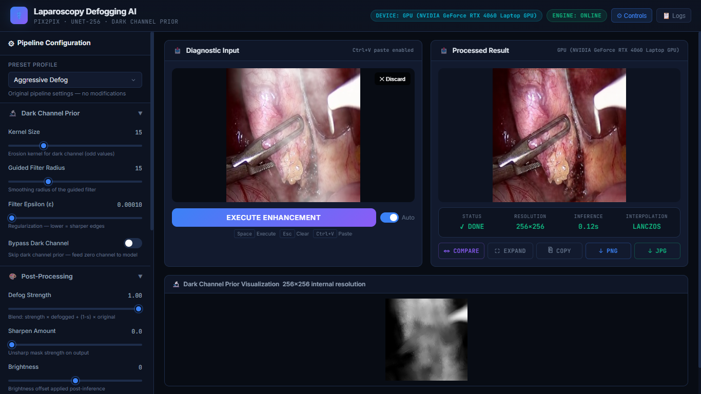
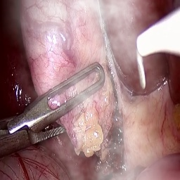
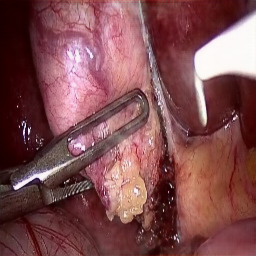
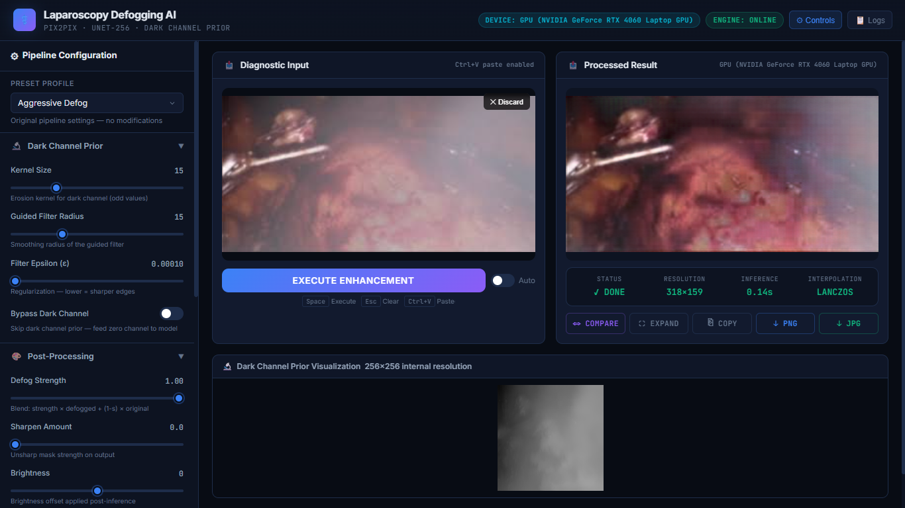

# Laparoscopy Image Defogging AI 🔬

An advanced, AI-powered pipeline designed to remove fog and surgical smoke from laparoscopy images in real-time. This project leverages a **Pix2Pix UNet-256 Generator** combined with a **Dark Channel Prior** and guided filtering to produce pristine, high-clarity surgical visuals.

## ✨ Features
- **State-of-the-art Defogging**: Uses a trained Pix2Pix model coupled with a physical scattering model (Dark Channel Prior).
- **Rich Web UI**: A beautiful, drag-and-drop web interface built with Flask, HTML, CSS, and JS.
- **Interactive Pipeline Controls**: Tweak the defogging strength, dark channel kernel size, guided filter radius, and regularization in real-time.
- **Advanced Post-Processing**: Built-in unsharp masking, contrast enhancement, and CLAHE (Contrast Limited Adaptive Histogram Equalization) for maximum clarity.
- **Before/After Comparisons**: Built-in interactive slider to compare original and enhanced images.

---

## 📸 Showcase

### The Defogging Pipeline

*The web UI in action, showing real-time inference and processing.*

### Before and After Details
| Before Defogging | After Defogging |
| :---: | :---: |
|  |  |

### Analyzing Different Scenarios

*Applying the pipeline to various laparoscopy images with custom dark channel parameters.*

---

## ⚙️ Installation

1. **Clone the repository**
   ```bash
   git clone <your-repo-url>
   cd Laparoscopy
   ```

2. **Create a Virtual Environment** (Optional but recommended)
   ```bash
   python -m venv .venv
   # Windows:
   .venv\Scripts\activate
   # Linux/Mac:
   source .venv/bin/activate
   ```

3. **Install Dependencies**
   ```bash
   pip install -r requirements.txt
   ```
   *(Ensure you have a CUDA-compatible PyTorch installation for GPU acceleration.)*

4. **⚠️ Critical Step: Add the Model Weights**
   The neural network weights (`best_net_G.pth`) are required to run inference.
   Place your `best_net_G.pth` file in the following directory:
   ```text
   scripts/checkpoints/pix2pix_laparoscopy_dc/best_net_G.pth
   ```
   *(If the `pix2pix_laparoscopy_dc` folder doesn't exist, create it).*

---

## 🚀 How to Run

### Option 1: One-Click Launcher (Windows)
We provide a `launch.bat` script that automatically detects your virtual environment, checks for the model weights, and starts the local server.
Simply double-click `launch.bat`!

### Option 2: Manual Launch
Activate your environment and run the Flask application:
```bash
python app.py
```
Then open your browser and navigate to: `http://127.0.0.1:5000`

---

## 🛠️ Tech Stack
- **Backend Model**: PyTorch, OpenCV, NumPy
- **Server**: Flask
- **Frontend**: HTML5, Vanilla CSS, Vanilla JavaScript

## 📄 License
This project is open-source and available under the [MIT License](LICENSE).
